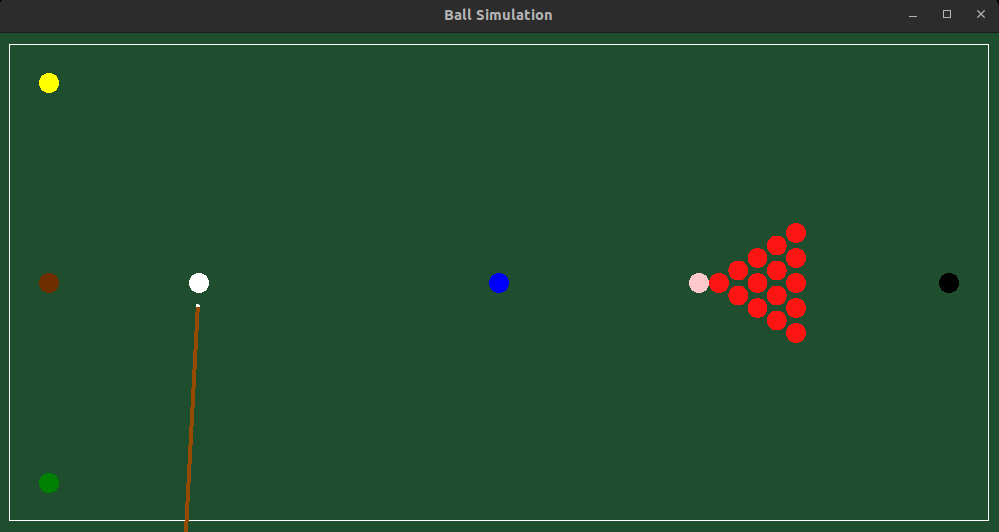

# Snooker_game

This program uses **SFML** for the graphical interface.

## Build Instructions

Follow these steps to build the project:

1. Download and install **SFML** from the official website:  
   [https://www.sfml-dev.org/](https://www.sfml-dev.org/)

2. Open a terminal and navigate to the project folder.

3. Run the following commands:

```bash
mkdir build
cd build
cmake ..
make
```

---

# Screenshot

